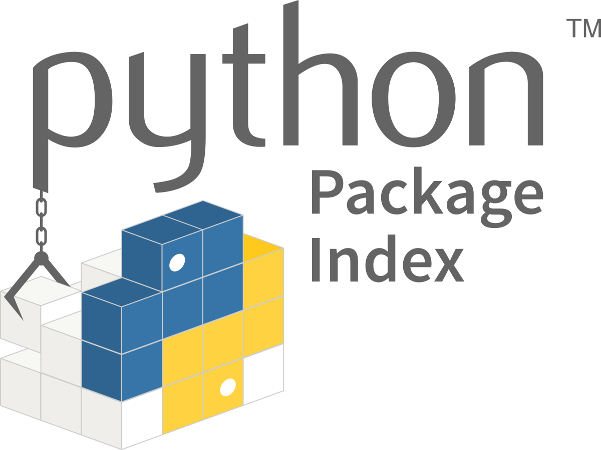

# Pippy

  

Pippy is a blazingly fast, extremely simply, and multi-problem solving package manager. It was built based on the foundations of `pip`, Pythons default package manager, and still retains a similar approach to package management.

## How it Works:

Pippy works in a almost-identical way to `pip`, with a few exceptions.

The first one is automatically creating virtual enviroments upon installing packages. The second one, is automatically creating a `pippy` file, that works similarly to a `requirements.txt`file. And finally, the third one is a better warning system that warns the user whenever packages have conflicts.

Pippy's logic is that package management should be simple, but still helpful and "batteries-included", and should also be able to be shared with others in a working space.

## Key Features:

-   :material-clock-fast:{ .lg .middle } __Easy to install__

    ---

    Install `pippy` with one simple installation script, requiring minimal time and effort.

    [:octicons-arrow-right-24: Installation](./getting-started/installation.md)

-   :material-language-python:{ .lg .middle } __Works like `pip`__

    ---

    Works like `pip`. Pippy dosn't redo concepts but rather expands on them.

    [:octicons-arrow-right-24: Core Concepts](./getting-started/concepts.md)

-   :material-format-font:{ .lg .middle } __Made to measure__

    ---

    Pippy is easily scaleable, allowing you to manage a lot of packages, without needing to worry about dependency hell.

    [:octicons-arrow-right-24: Customization](./getting-started/concepts.md)

-   :material-scale-balance:{ .lg .middle } __Open Source, GNU__

    ---

    You are in good hands with our GNU V3.0 public license. Feel free to help build and contribute to Pippy!

    [:octicons-arrow-right-24: License](#)

